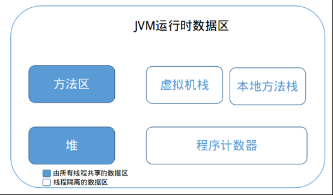

# JVM运行内存划分

# 程序计数器
1.记录当前程序字节码的行号，用于获取下一条执行的字节码。

2.每个线程都有一个私有的程序计数器用于字节码指令（如循环，跳转，异常等）。

3.程序计数器是以上五个模块唯一一个不会出现OutOfMemory的模块。也就是说其余四个模块都有可能出现OutOfMemory。

# 虚拟机栈
[虚拟机栈内存溢出](../jvm/src/VirtualMemory.java)