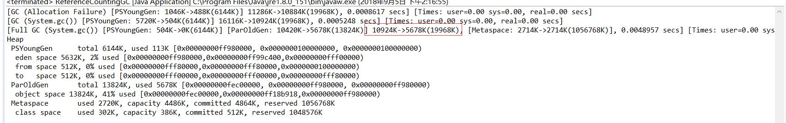

# GC的作用
- 那些内存需要回收
- 什么时候回收
- 怎么回收

## 那些对象需要回收
 
### 引用计数算法

- 其实就是是创建的一个对象都有一个对应的计数器，每次对象有引用计数器就会加一，每次对象的引用消除这个计数器就会减一。

- 在执行full gc的时候就会把计数器为0的对象全部释放。

- 此算法的缺点是不能解决循环引用的问题。[示例代码](../../java/src/jvm/calculate/ReferenceCountingGC.java)

运行结果如图  

从 ``10924K->5678K(19968K)``可以看出其实objA和objB已经被回收了，所以jvm已经没有使用这个回收算法了。

### 可达性分析算法

- 此算法的逻辑就是先设置一些根节点(GC Root)，与这些跟节点有关联的都不会被回收。当一个对象往上找不到设置的根节点时此对象就会被回收。
如图：obj5,obj6,obj7在执行full GC时将会被回收。

- GC Root包括以下几种
(1) 虚拟机栈（栈帧中的本地变量表）中引用的对象。
(2) 方法区中类静态属性引用的对象。
(3) 方法区中常量引用的对象。
(4) 本地方法栈中JNI（即一般说的Native方法）引用的对象。

.jpg)
