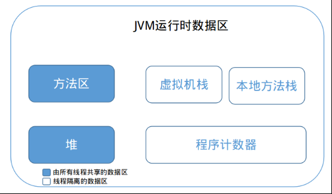

# JVM运行内存划分

# 程序计数器
1.记录当前程序字节码的行号，用于获取下一条执行的字节码。

2.每个线程都有一个私有的程序计数器用于字节码指令（如循环，跳转，异常等）。

3.程序计数器是以上五个模块唯一一个不会出现OutOfMemory的模块。也就是说其余四个模块都有可能出现OutOfMemory。

# 虚拟机栈
1.与程序计数器一样他也是每个线程独有的一个模块生命周期与线程相同。

2.虚拟机栈在每个方法执行的同时都会创建一个栈帧(后续会讲)用于储存局部变量表，操作数栈，动态链接，方法出口信息。

3.java虚拟机栈规范中，对这个区域规定了两种异常情况:
  
>a)如果线程请求的栈深度大于虚拟机所允许的深度，将抛出StackOverflowError异常（[示例代码](../../jvm/src/jvm/VirtualStack.java)）
   
>b)如果虚拟机可以动态扩展，但是扩展时无法申请到足够的内存，就会抛出OutOfMemoryError异常([示例代码](../../jvm/src/jvm/VirtualMemory.java))

# 本地方法栈
本地方法栈和虚拟机栈所发挥的作用基本一致唯一的区别就是虚拟机用到了Native方法服务时只会使用本地方法栈。
与虚拟机栈一样都会出现StackOverflowError和OutOfMemoryError

# 堆
1.堆是虚拟机中内存中最大的一块。他是被所有的线程共享的一块内存区域。

2.堆在内存中的唯一目的就是存放对象实例，基本上所有的对象实例都是在堆中分配内存的。

3.堆是垃圾收集器管理的主要区域。由于垃圾收集器大多数采用分代收集算法，所以堆可以分为新生代和老年代。

```java
        //堆内存溢出示例
        public class HeapMemory{
            public static void main(String[] args){
                java.util.List list = new java.util.ArrayList();
                while(true){
                    list.add(new HeapStackOver());
                }
            }
        }
        //堆内存泄露示例
        public class HeapStack{
            public static void main(String[] args){
                java.util.Vector vector = new java.util.Vector();
                for (int i =1;i<100;i++) {
                    Object o = new Object();
                    vector.add(o);
                    o=null;
                }
            }
        }
```

# 方法区
他也是被所有线程共享的。存储已经被虚拟机加载的类信息、常亮、静态变量等。

# 运行时常量池
运行时常量池是方法区的一部分，其中存放了一些符号引用。当 new一个对象时，会检查这个区域是否有这个符号的引用。
