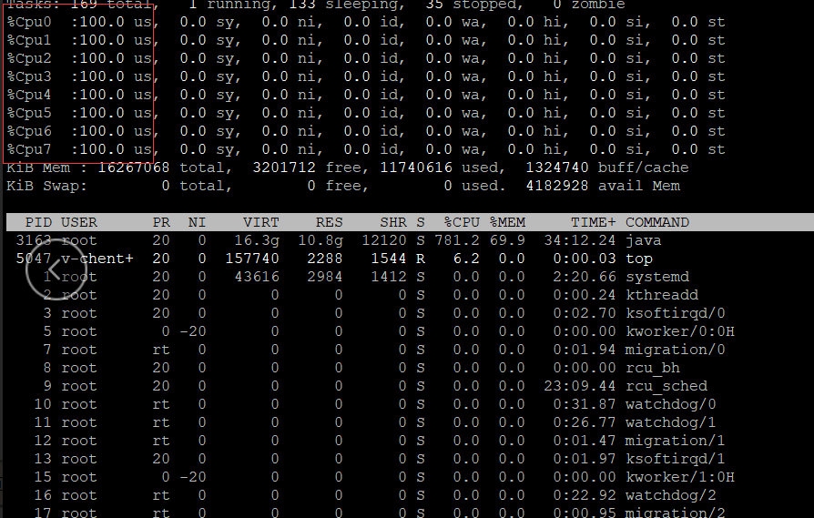
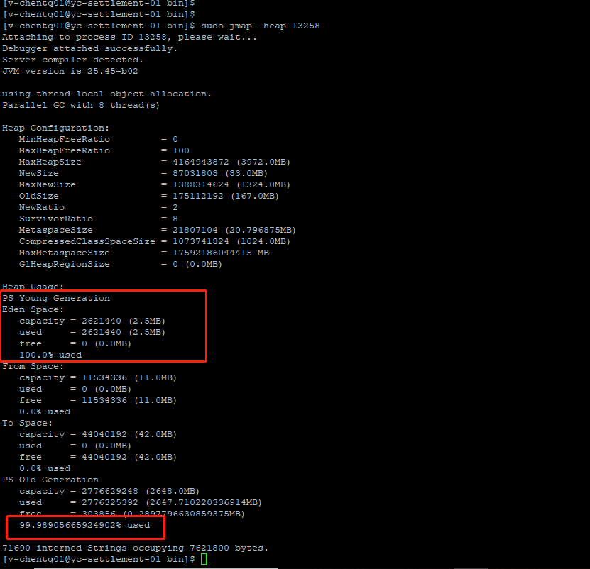
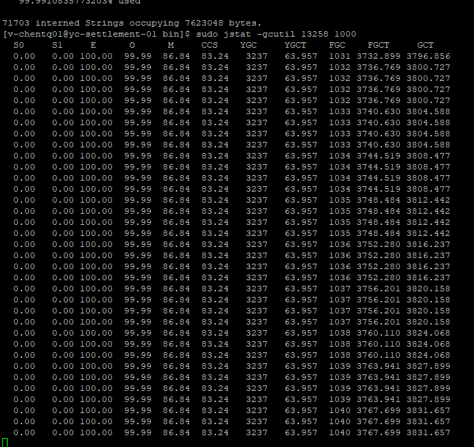

# JVM内存溢出导致的CPU过高问题排查
在近期做压力测试过程中发现50个线程会导致应用层CPU居高不下。
分析：线程数很少，数据量也不多。初步怀疑是某些程序逻辑不够严谨。
初步怀疑是有些老年代的东西不会被GC回收，导致老年代占比一直很高，试GC不停地fullGC,导致CPU过高。

- 在linux上执行top命令发现CPU在100%
 
 
- 执行sudo ./jmap -heap pid(java线程的pid可以根据top命令查询)可以看出老年代在90%以上。
 
 
- 再看看fullGC的频率

 