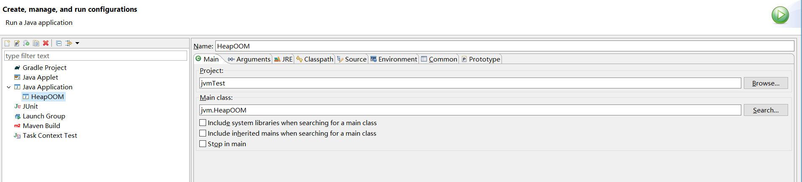
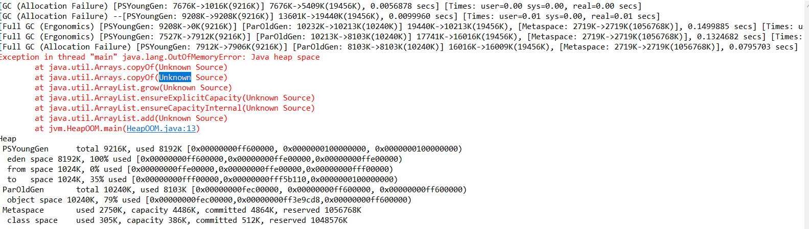

# OutOfMemoryError异常

## JAVA堆溢出

   - java堆用于存储对象实例。只要不断的创建对象，并保证对象之间有可达的路径。这些对象就不会被GC给回收，当达到一定的量时就会抛出OutOfMemoryError。
   - 以下代码是在Eclipse IDE上执行需要设置run/debug的jvm参数和MAT解析。
   - 这里需要先设置以下jvm参数防止电脑CPU爆满导致电脑卡死。
   
   [点我查看代码](../../jvm/src/jvm/HeapOOM.java)
   
    运行结果
   
   - [堆栈分析](堆栈分析.md)
   - 对于这样的异常一般都是代码问题，需要调整代码。但是这样的问题可能在本地测试不出来，所以需要借助工具来检验。这里有一个服务器问题[排查案例](JVMOutOfMemorySolve.md)。当然假如检查代码确实没有问题这时就需要修改Xmx和Xms当服务器剩下内存全部给jvm这时不行就要考虑是不是要加服务器了。   

