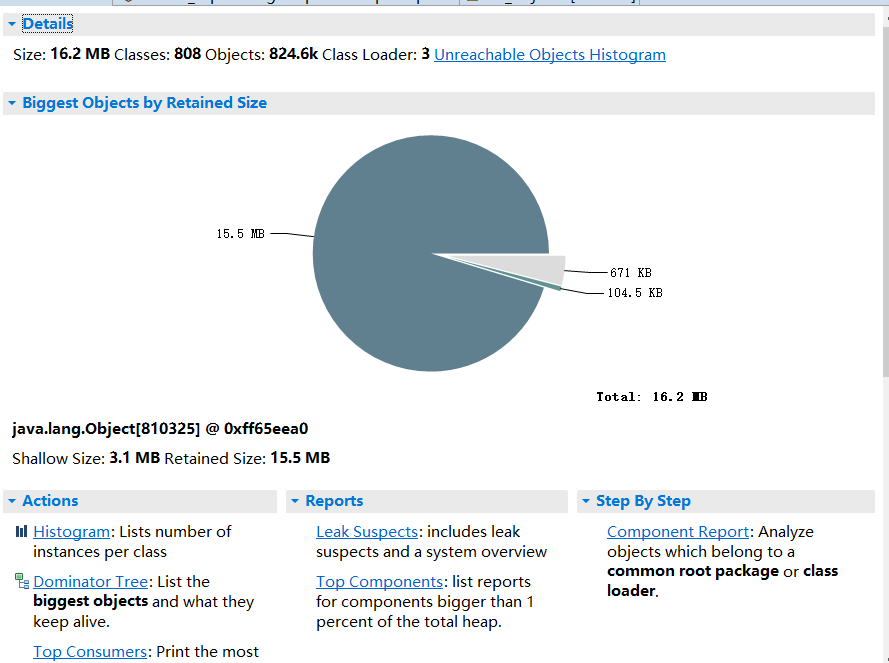
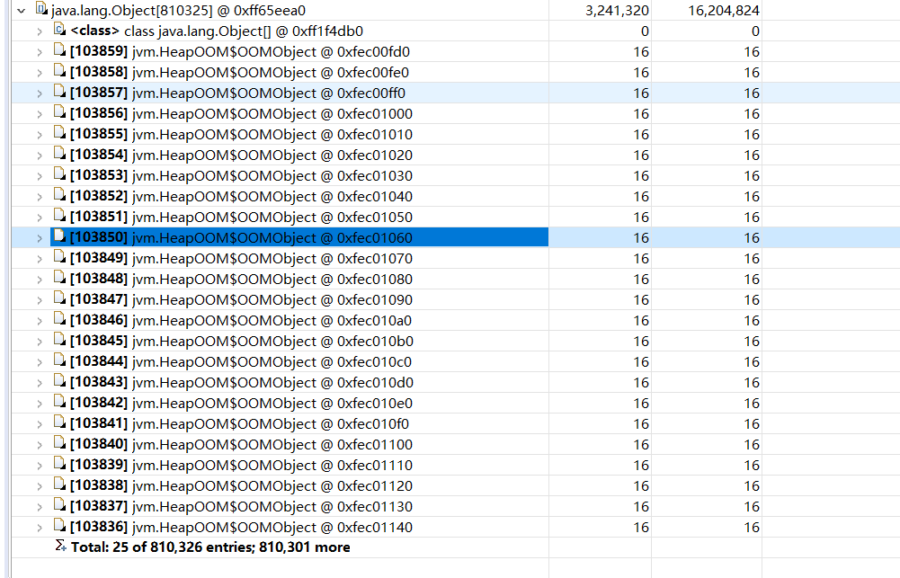

- 由于运行的太快建议在OutOfMemoryError上增加断点。运行到断点时不要放开他。

- 获取对应的pid获取方式

- 执行jmap -heap `pid`  命令

从图中可以发现Eden Space和Old Generation已经快达到100%基本确定代码有问题

- 生成dump文件，执行 jmap.exe -dump:file=`生成文件的位子` `pid`

- 使用eclipse打开dump文件，先要下载eclipse插件Memory Analyzer tool,然后File -> Open Heap Dump进行堆栈分析

点击扇形区域最大的地方List object -> with outgoing references发现一个对象里面有很多小对象。如图

